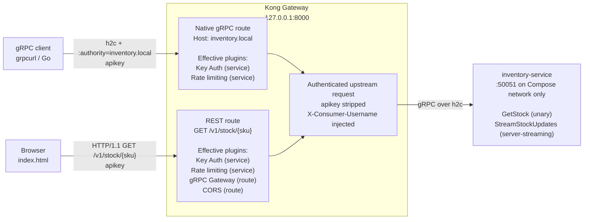
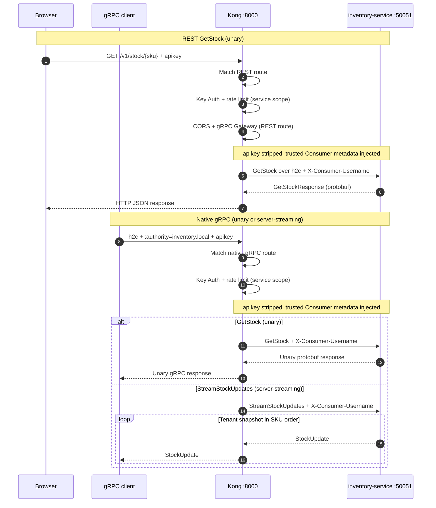

# Kong + gRPC (Go)

This repository is a local multi-tenant inventory demo. Kong Key Auth identifies
each tenant, proxies native gRPC, and transcodes REST requests to the same Go
gRPC service.

## Why this demo exists

This repository is a runnable companion to Jubelio's Engineering Sharing
Session, "Kong API Gateway: Why we're moving off KrakenD — and what we get in
return." It turns the presentation's concepts—Routes, Services, Consumers,
authentication, plugin scopes, rate limiting, and gRPC support—into a small
demo that can be exercised locally.

The demo intentionally uses a DB-less Kong deployment and simplified Consumers
(`company-a` and `company-b`). It supports the presentation's technical
narrative, but does not reproduce Jubelio's production Hybrid deployment, Kong
Manager, Upstream health checks, or custom Lua plugins.

## Trust boundary and request flow

Tenant identity follows one trusted path:

```text
client apikey -> Kong Key Auth -> X-Consumer-Username -> Go inventory map
```

The client supplies only an `apikey`. Kong validates it, injects the matched
Consumer username, and does not forward the credential upstream. The Go service
uses only that authenticated Consumer metadata to select a company inventory
map, so caller-supplied tenant identity cannot select another tenant.

The inventory service listens on container port `50051`, but that port is
unpublished and is reachable only from the Compose network. Clients enter
through Kong on `127.0.0.1:8000`.

## Architecture

The single loopback proxy port `127.0.0.1:8000` accepts both HTTP/1.1 REST and
plaintext HTTP/2 gRPC (h2c):

### Components and routing



### Request sequence



The native gRPC route is selected with the `inventory.local` authority. The
REST route exposes `GET /v1/stock/{sku}` through Kong's `grpc-gateway` plugin.
Only the unary `GetStock` RPC is transcoded; `StreamStockUpdates` is available
only through native gRPC.

Key Auth and local rate limiting apply at the Kong service level, so they cover
both routes. CORS applies to the REST route and handles browser preflights
locally.

## Demo credentials

| Consumer | Demo API key |
| --- | --- |
| `company-a` | `company-a-demo-key` |
| `company-b` | `company-b-demo-key` |

Both keys are public, static demo credentials and are local-only. They are not
secrets and must not be reused outside this demo.

## Prerequisites and startup

Install or provide:

- Go 1.25.3 or newer;
- `protoc 35.1`;
- Docker with Docker Compose;
- `curl`, `jq`, and `grpcurl`.

If `grpcurl` is not already available, install the pinned release:

```bash
GOBIN=~/.local/bin go install github.com/fullstorydev/grpcurl/cmd/grpcurl@v1.9.3
```

Ensure `~/.local/bin` is on `PATH`, then use these repository commands:

```bash
make proto
make proto-check
make up
make reload
make logs
make down
```

- `make proto` verifies the pinned generator toolchain and regenerates the Go
  protobuf files.
- `make proto-check` regenerates the files and fails if the checked-in output
  differs.
- `make up` builds and starts the full Compose stack, waiting for readiness.
- `make reload` validates and gracefully reloads the bind-mounted DB-less Kong
  configuration.
- `make logs` follows logs from both services.
- `make down` removes the local Compose containers and network.

## API examples

### REST `GetStock`

Company A:

```bash
curl -H 'apikey: company-a-demo-key' \
  http://localhost:8000/v1/stock/SKU-001
```

```json
{"sku":"SKU-001","quantity":42,"warehouse":"WH-JKT-01"}
```

Company B requests the same SKU but receives its own quantity:

```bash
curl -H 'apikey: company-b-demo-key' \
  http://localhost:8000/v1/stock/SKU-001
```

```json
{"sku":"SKU-001","quantity":100,"warehouse":"WH-JKT-01"}
```

### Native gRPC `GetStock`

Company A:

```bash
grpcurl -plaintext -authority inventory.local \
  -H 'apikey: company-a-demo-key' \
  -d '{"sku":"SKU-001"}' \
  localhost:8000 inventory.InventoryService/GetStock
```

```json
{
  "sku": "SKU-001",
  "quantity": 42,
  "warehouse": "WH-JKT-01"
}
```

Company B:

```bash
grpcurl -plaintext -authority inventory.local \
  -H 'apikey: company-b-demo-key' \
  -d '{"sku":"SKU-001"}' \
  localhost:8000 inventory.InventoryService/GetStock
```

```json
{
  "sku": "SKU-001",
  "quantity": 100,
  "warehouse": "WH-JKT-01"
}
```

### Native gRPC `StreamStockUpdates`

Company A:

```bash
grpcurl -plaintext -authority inventory.local \
  -H 'apikey: company-a-demo-key' \
  -d '{}' \
  localhost:8000 inventory.InventoryService/StreamStockUpdates
```

```json
{"sku":"SKU-001","quantity":42,"updatedAtUnix":"1784102400"}
{"sku":"SKU-002","quantity":7,"updatedAtUnix":"1784102401"}
```

Company B:

```bash
grpcurl -plaintext -authority inventory.local \
  -H 'apikey: company-b-demo-key' \
  -d '{}' \
  localhost:8000 inventory.InventoryService/StreamStockUpdates
```

```json
{"sku":"SKU-001","quantity":100,"updatedAtUnix":"1784102400"}
{"sku":"SKU-777","quantity":3,"updatedAtUnix":"1784102401"}
```

Each stream contains the authenticated tenant's two records in SKU order.
`updatedAtUnix` is shown as a quoted decimal string because ProtoJSON encodes
`int64` values as strings; its runtime value changes on every execution.

## Error behavior

Kong rejects a missing or invalid API key before the request reaches the Go
service. After successful authentication, the gRPC service follows this error
contract:

| Condition | Result |
| --- | --- |
| Missing or invalid API key at Kong | unauthenticated request rejected before upstream |
| Missing, empty, or ambiguous consumer metadata | `Unauthenticated` |
| Authenticated consumer without a company map | `PermissionDenied` |
| Empty SKU | `InvalidArgument` |
| Missing SKU for a known company | `NotFound` |
| Stream canceled | `Canceled` |
| Stream deadline exceeded | `DeadlineExceeded` |
| Stream send failure | original send error |

For REST-transcoded calls, Kong maps the upstream gRPC status to an HTTP
response. The CORS configuration exposes `grpc-status` and `grpc-message` so
browser JavaScript can display error detail.

## Readiness and exposed ports

Compose checks inventory readiness with a TCP connection to `50051`. Kong's
healthcheck then requires HTTP 200 from its internal `/status/ready` endpoint.
`make up` runs `docker compose up --build -d --wait`, so it returns only after
both containers report healthy.

Kong's Admin API is disabled. Its Status API is bound only inside the Kong
container, the inventory port is not published, and the TLS proxy listener is
not enabled. The only published host port is `127.0.0.1:8000`, shared by
HTTP/1.1 REST and plaintext HTTP/2 gRPC traffic.

After editing `kong.yml`, `make reload` validates and gracefully reloads the
declarative configuration without recreating the stack.

## Local-demo limitations

- All proxy and upstream gRPC traffic uses plaintext h2c.
- Both API keys are static, public, local-only credentials.
- Inventory data is held in memory.
- Rate limiting uses Kong's local policy and is not shared across nodes.
- CORS permits every origin for the demo REST route.
- There is no persistence; restarting the service restores the compiled sample
  data.

Production transport controls should follow the actual threat model. TLS or
mTLS may be appropriate depending on network trust, identity, and compliance
requirements; neither transport is claimed to be universally mandatory here.

The selected image, `kong/kong-gateway:3.14.0.8-ubuntu`, is Kong Gateway
Enterprise 3.14 LTS. Free Mode is no longer available starting in 3.10; this
local demo starts without a license and therefore follows expired-license
behavior. It must not be presented as licensed or supported production use.

## Repository layout

```text
.
├── .dockerignore                  # Excludes local/build files from image context
├── Dockerfile                     # Go 1.25/Alpine multi-stage service image
├── Makefile                       # Generation, verification, and Compose commands
├── README.md                      # Authenticated local workflow
├── docker-compose.yml             # Private service plus loopback-only Kong proxy
├── go.mod / go.sum                # Go module and checksums
├── index.html                     # REST browser client using the apikey header
├── inventory.proto                # Inventory API and REST annotation
├── kong.yml                       # DB-less routes, Consumers, and plugins
├── main.go                        # Inventory gRPC service
├── main_test.go                   # Service, auth, stream, and timing tests
├── proto/gen/                     # Checked-in generated Go protobuf code
└── third_party/google/api/        # Vendored HTTP annotation protos
```

Pinned runtime and generation versions:

- Kong: `kong/kong-gateway:3.14.0.8-ubuntu`
- builder: `golang:1.25-alpine3.24`
- runtime: `alpine:3.24`
- protobuf compiler: `protoc 35.1`
- Go protobuf generator: `protoc-gen-go v1.36.11`
- Go gRPC generator: `protoc-gen-go-grpc v1.6.2`
