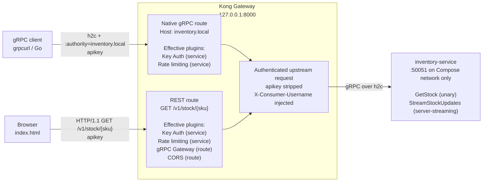
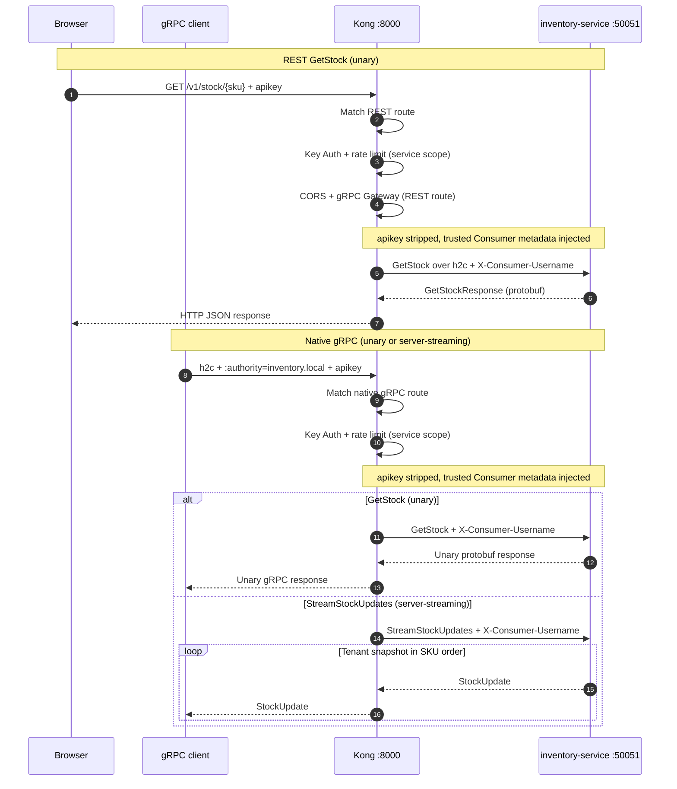

# README Architecture Diagrams Implementation Plan

> **For agentic workers:** REQUIRED SUB-SKILL: Use superpowers:subagent-driven-development (recommended) or superpowers:executing-plans to implement this plan task-by-task. Steps use checkbox (`- [ ]`) syntax for tracking.

**Goal:** Restore the README's detailed architecture guidance as two accurate, GitHub-rendered Mermaid diagrams.

**Architecture:** Replace the short text sketch under `## Architecture` with one component flowchart and one sequence diagram. Both diagrams derive their trust boundary, route scope, plugin scope, protocols, and port exposure from the committed Kong and Compose configuration.

**Tech Stack:** GitHub Flavored Markdown, Mermaid flowchart and sequence-diagram syntax, shell assertions, transient Mermaid parser validation.

## Global Constraints

- Modify only `README.md` during implementation.
- Add exactly two Mermaid blocks and no generated image, PlantUML file, renderer configuration, or repository dependency.
- Clients supply `apikey`; they never supply a trusted tenant identity header.
- Key Auth and rate limiting are service-scoped and cover both routes.
- gRPC Gateway and CORS apply only to the REST route.
- REST transcodes only unary `GetStock`; native gRPC exposes both `GetStock` and `StreamStockUpdates`.
- Kong strips `apikey` and injects `X-Consumer-Username` upstream.
- Inventory port `50051` remains internal to the Compose network.
- Preserve the explanatory prose following the existing architecture sketch.

---

### Task 1: Replace the stale text sketch with two Mermaid diagrams

**Files:**

- Modify: `README.md:22-38`
- Reference: `kong.yml:13-66`
- Reference: `docker-compose.yml:5-57`
- Reference: `docs/superpowers/specs/2026-07-15-kong-grpc-demo-hardening-design.md:265-290`

**Interfaces:**

- Consumes: the committed route, plugin, trust-boundary, and port-containment configuration.
- Produces: exactly one Mermaid `flowchart LR` and one Mermaid `sequenceDiagram` in the README architecture section.

- [ ] **Step 1: Prove the two-diagram requirement is not yet satisfied**

Run:

```bash
set -euo pipefail
count="$(rg -c '^```mermaid$' README.md || true)"
test "${count:-0}" -eq 2
```

Expected: the final `test` exits non-zero because the README currently contains zero Mermaid blocks.

- [ ] **Step 2: Replace the short text sketch with the complete diagram content**

Keep the opening Architecture paragraph, replace its `text` code block, and leave the existing explanatory prose after the new diagrams. Insert this exact Markdown:

````markdown
### Components and routing



### Request sequence


````

- [ ] **Step 3: Run focused content and security assertions**

Run:

```bash
set -euo pipefail
test "$(sed -n '/^## Architecture$/,/^## Demo credentials$/p' README.md | rg -c '^```mermaid$')" -eq 2
test "$(rg -c '^flowchart LR$' README.md)" -eq 1
test "$(rg -c '^sequenceDiagram$' README.md)" -eq 1
rg -q 'Key Auth \(service\)' README.md
rg -q 'gRPC Gateway \(route\)' README.md
rg -q 'X-Consumer-Username injected' README.md
rg -q ':50051 on Compose network only' README.md
rg -q 'StreamStockUpdates \(server-streaming\)' README.md
! rg -n 'X-Company-Id|x-company-id' README.md
! rg -n 'REST client -- HTTP/1\.1|gRPC client -- HTTP/2' README.md
```

Expected: every positive assertion finds the approved content, every negative assertion has no match, and the block exits zero.

- [ ] **Step 4: Parse both Mermaid blocks without adding a project dependency**

Run:

```bash
set -euo pipefail
tool_dir="$(mktemp -d)"
trap 'rm -rf "$tool_dir"' EXIT
npm install --silent --prefix "$tool_dir" --ignore-scripts mermaid@11.16.0

overview="$(awk '
  /^```mermaid$/ { block++; next }
  /^```$/ && block == 1 { exit }
  block == 1 { print }
' README.md)"
sequence="$(awk '
  /^```mermaid$/ { block++; next }
  /^```$/ && block == 2 { exit }
  block == 2 { print }
' README.md)"

MERMAID_MODULE="$tool_dir/node_modules/mermaid/dist/mermaid.esm.min.mjs" \
OVERVIEW="$overview" SEQUENCE="$sequence" \
node --input-type=module -e '
  const mermaid = (await import(process.env.MERMAID_MODULE)).default;
  const overview = await mermaid.parse(process.env.OVERVIEW, { suppressErrors: false });
  const sequence = await mermaid.parse(process.env.SEQUENCE, { suppressErrors: false });
  if (overview.diagramType !== "flowchart-v2") throw new Error(overview.diagramType);
  if (sequence.diagramType !== "sequence") throw new Error(sequence.diagramType);
  console.log("Mermaid parse passed: flowchart-v2, sequence");
'
```

Expected: `Mermaid parse passed: flowchart-v2, sequence`. The temporary parser installation is removed by the trap and does not alter `package.json`, a lockfile, or any repository dependency.

- [ ] **Step 5: Verify scope and repository health**

Run:

```bash
set -euo pipefail
test "$(git diff --name-only)" = README.md
git diff --check
go test ./...
```

Expected: only `README.md` is modified, the diff is whitespace-clean, and the Go test suite passes.

- [ ] **Step 6: Commit the README diagrams**

Run:

```bash
git add README.md
git diff --cached --check
test "$(git diff --cached --name-only)" = README.md
git commit -m "docs: restore architecture diagrams"
```

Expected: one README-only implementation commit.

- [ ] **Step 7: Push the branch and verify the existing draft PR moved to the new commit**

Run:

```bash
set -euo pipefail
git push origin codex/harden-multitenant-demo
test "$(git rev-parse HEAD)" = "$(git rev-parse origin/codex/harden-multitenant-demo)"
gh pr view 1 --repo revell29/kong-go-grpc-example \
  --json isDraft,state,headRefOid,url | \
  jq -e --arg oid "$(git rev-parse HEAD)" '
    .isDraft == true and
    .state == "OPEN" and
    .headRefOid == $oid and
    .url == "https://github.com/revell29/kong-go-grpc-example/pull/1"'
```

Expected: the fork branch and upstream draft PR both point to the diagram commit.
